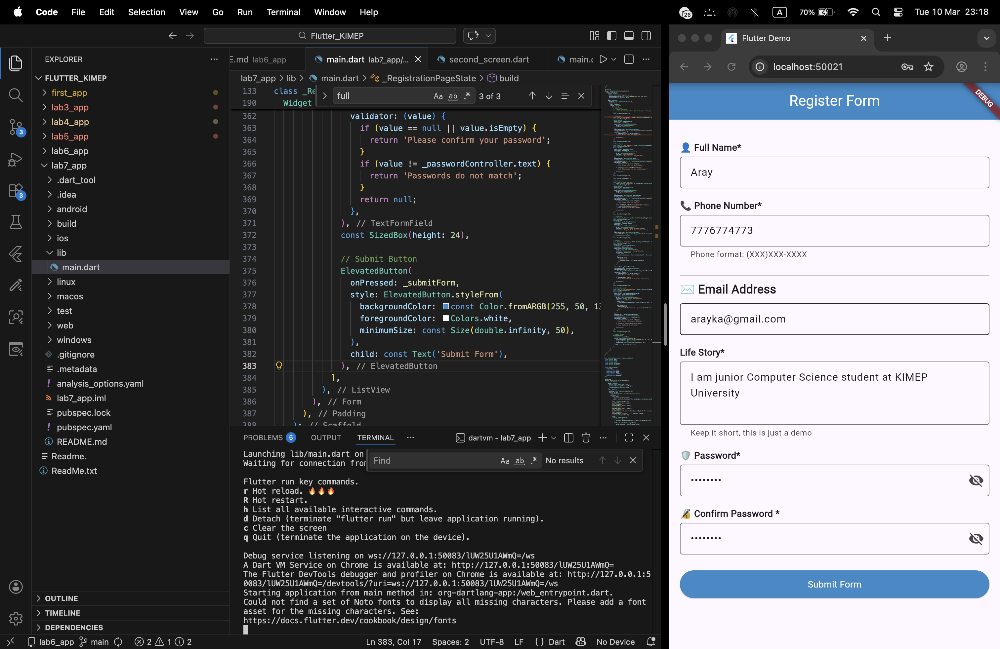
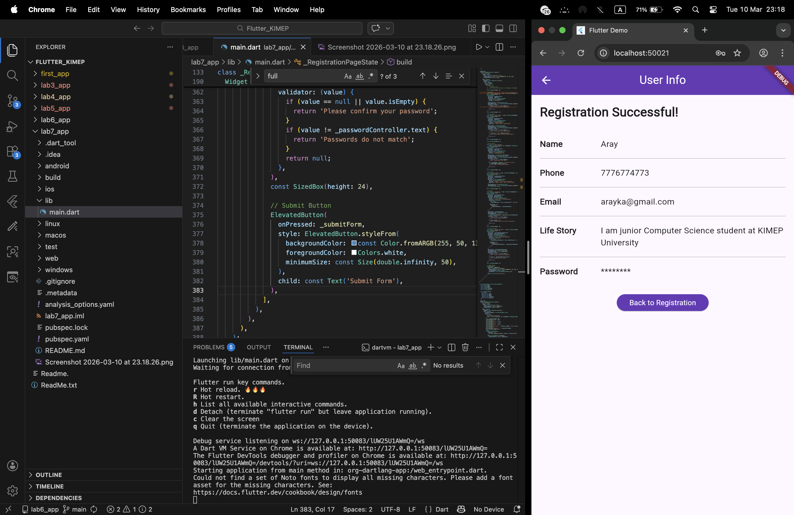

# Laboratory Work No. 7: Registration Form with Validation in Flutter

**Objective:** Create a user registration form with validation using Flutter's `TextFormField`, `FocusNode`, `GlobalKey<FormState>`, input decorations, and implement password visibility toggle with `suffixIcon`.

## Functional Requirements

- **Form Fields:**
  - Full Name (required, not empty)
  - Phone Number (digits only, required)
  - Email Address (required, valid email format)
  - Life Story (multiline, optional)
  - Password (minimum 6 characters, required)
  - Confirm Password (must match password)

- **Validation:** All fields except Life Story are validated when the "Submit Form" button is pressed.
- **Focus Management:** Each field has its own `FocusNode`, with "Next" button navigation on the keyboard.
- **Controllers:** Each field is connected to a separate `TextEditingController`.
- **Password Toggle:** Eye icon toggles visibility in Password and Confirm Password fields.
- **Navigation:** After successful validation, the `UserInfoPage` opens displaying the entered data (password hidden with asterisks).

## Application Pages

1. **Registration Page** – registration form.
2. **UserInfoPage** – page displaying the entered data.

## Screenshots

### Registration Page


### UserInfoPage


## Running the Project

1. Ensure Flutter SDK is installed.
2. Clone the repository:
   ```bash
   git clone https://github.com/arayakhylbek/Lab7_app.git